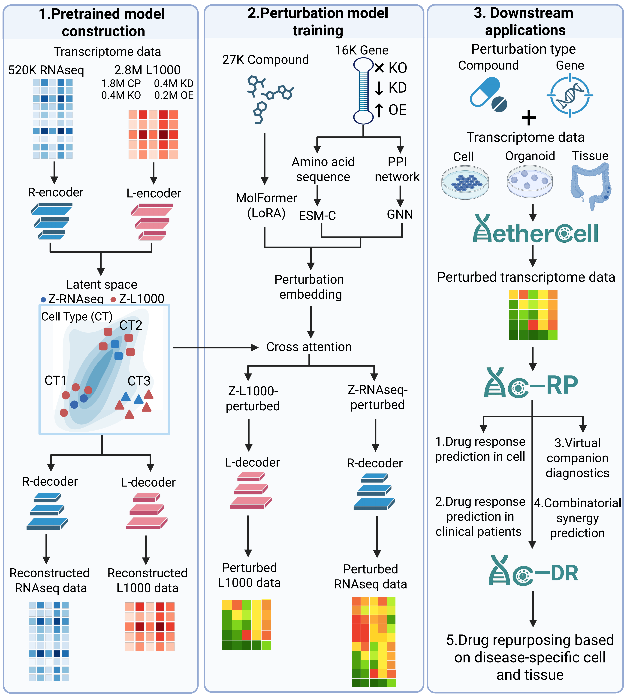

# AetherCell enables cross-platform transfer of perturbation responses to diverse transcriptomic contexts

> Repository accompanying *AetherCell enables cross-platform transfer of perturbation responses to diverse transcriptomic contexts*.

[](https://www.python.org/)
[](https://pytorch.org/)
[](https://huggingface.co/liwenyuan99/AetherCell)
[](https://huggingface.co/liwenyuan99/AetherCell)
[](http://101.32.8.25/)
[](https://doi.org/10.5281/zenodo.18295255)

**Resources**

| Resource | Link |
|---|---|
| Preprint | [bioRxiv 10.64898/2026.03.13.710968](https://www.biorxiv.org/content/10.64898/2026.03.13.710968v1) |
| Model weights and Agent Skills | [Hugging Face — liwenyuan99/AetherCell](https://huggingface.co/liwenyuan99/AetherCell) |
| Processed datasets | [Zenodo 10.5281/zenodo.18295255](https://zenodo.org/records/18295255) |
| Web demo | [http://101.32.8.25/](http://101.32.8.25/) |



## Overview

AetherCell is a generative modelling framework that aligns context-rich bulk RNA-seq data with perturbation-dense L1000 data in a shared latent space. The framework supports three core research tasks:

1. **Virtual perturbation modelling** — predict transcriptomic changes from drug treatment, gene knockdown (shRNA), overexpression (OE), or knockout (CRISPR/Cas9).
2. **Drug response prediction** — estimate drug sensitivity (IC50 / AUC) on cancer cell lines.
3. **Drug repurposing** — rank FDA-approved drug candidates for a given disease via a Mixture-of-Experts model fusing transcriptomic similarity and knowledge-graph reasoning.

Beyond a static model release, AetherCell is packaged as an **Agent-Ready engine**. The released inference package ships with executable Skills that can be invoked through natural language in [Claude Code](https://claude.ai/claude-code), making transcriptome prediction, drug-response prediction, and drug repurposing accessible without writing pipeline code.

The reviewer-facing training, download, batch-inference, and benchmark additions documented later in this README supplement the Agent-Ready release; they do not replace it.

For architecture details, training objectives, and benchmark results, please refer to the manuscript.

## Access modes

AetherCell provides four complementary ways to use the models.

### Mode 1 — Web demo

The fastest way to test the drug-screening pipeline is [http://101.32.8.25/](http://101.32.8.25/). The demo runs AetherCell's screening pipeline with an LLM-generated interpretive report. Daily API quota is limited.

### Mode 2 — Agent Skills via Claude Code

For interactive, natural-language-driven analysis without writing code, download and extract the released inference package, then run:

```bash
cd aethercell-drug-discovery-v1.0.0
claude
```

Example prompts:

```text
Predict the transcriptomic effect of Aspirin and perform pathway enrichment.
SMILES: CC(=O)Oc1ccccc1C(=O)O
```

```text
Find the top 20 drug repurposing candidates for Alzheimer disease.
```

```text
Predict IC50 of this compound on A549 cells: CC(C)Cc1ccc(cc1)C(C)C(O)=O
```

Three built-in Skills are provided:

- **Transcriptome Prediction** — drug/gene perturbation to DEGs and pathway enrichment.
- **IC50 Prediction** — drug sensitivity on cancer cell lines.
- **Drug Repurposing** — disease-centric candidate ranking.

Each Skill automates model loading, inference, and result formatting. The Skills are distributed inside `aethercell-drug-discovery-v1.0.0/.claude/skills/` in the Hugging Face package rather than duplicated in this lightweight Git repository.

### Mode 3 — Python API

For programmatic use, batch experiments, and integration into custom pipelines, use the API included in `aethercell-drug-discovery-v1.0.0/`.

#### Transcriptome prediction

```python
from models.transcriptome_prediction.transcriptome_inference import TranscriptomePredictor

predictor = TranscriptomePredictor(
    model_type="l1000",        # "l1000" (978 genes) or "bulk_rnaseq" (10085 genes)
    perturbation="drug",       # "drug", "shrna", "oe", or "xpr"
    device="cpu",
)
result = predictor.predict(
    drug_smiles="CC(=O)Oc1ccccc1C(=O)O",
    cell_line="MCF7",
)

# result["expression"] — predicted expression array
# result["delta"]      — fold changes versus control
# result["top_genes"]  — top differentially expressed genes
```

#### Drug response prediction

```python
from models.ic50_prediction.ic50_inference import IC50Predictor

predictor = IC50Predictor(device="cpu")
result = predictor.predict(
    drug_smiles="CC(C)Cc1ccc(cc1)C(C)C(O)=O",
    cell_line="A549",
)
print(result["prediction"])
print(result["probability"])
```

#### Drug repurposing

```python
from models.moe_repurposing.moe_inference import MoEPredictor

predictor = MoEPredictor()
results = predictor.predict_for_disease("Alzheimer disease", top_n=10)
print(results[["drugbank_id", "moe_score", "te_score", "kg_score"]])
```

Supported virtual perturbations are:

| Perturbation | `perturbation` value | Input |
|---|---|---|
| Drug treatment | `"drug"` | SMILES string |
| Gene knockdown | `"shrna"` | Gene symbol or ENSG ID |
| Gene overexpression | `"oe"` | Gene symbol or ENSG ID |
| Gene knockout (CRISPR) | `"xpr"` | Gene symbol or ENSG ID |

### Mode 4 — Training-scale batch workflows

The `src/` directory and installable `aethercell` package provide large-scale drug and shRNA inference, training, and downstream reproduction workflows. These require the processed Zenodo data in addition to the released weights. See [Portable batch inference](src/INFERENCE_README.md) and the reviewer reproducibility sections below.

## What is reproducible in this repository?

| Component | Entry point | Included small input | Full assets |
|---|---|---:|---|
| AetherCell drug training | `aethercell-train` | deterministic smoke mode | Zenodo + model package |
| Specificity-aware objective | `aethercell.losses` | unit tested | no external data |
| Batch perturbation inference | `aethercell-batch-infer` | portable NPZ contract | Zenodo + model package |
| AC-RP evaluation | `aethercell-reproduce ac-rp` | `examples/data/ac_rp_predictions.csv` | model package |
| Drug synergy evaluation | `aethercell-reproduce synergy` | `examples/data/synergy_predictions.csv` | model package |
| CDx ranking | `aethercell-reproduce cdx` | `examples/data/cdx_predictions.csv` | model package |
| TCGA clinical evaluation | `aethercell-reproduce tcga` | `examples/data/tcga_predictions.csv` | model package |
| AC-DR drug repurposing | `aethercell-acdr` and `aethercell-reproduce ac-dr` | `examples/data/ac_dr_predictions.csv` | model package |

The files under `examples/data/` are model outputs from the reported pipelines. They let a reviewer reproduce the metric and ranking code in seconds, without downloading multi-gigabyte weights. They are not substitutes for end-to-end model inference.

## Installation

Python 3.10 is the tested version.

```bash
conda env create -f environment.yml
conda activate aethercell
pip install -e ".[model,test]"
```

Before running an analysis, use the built-in preflight checker. It never downloads silently; when an asset is absent it prints the exact verified command and source URL.

```bash
aethercell-doctor          # code + required Python packages
aethercell-doctor --full   # additionally require all model and processed-data assets
```

For a fast CPU integration test that performs two optimization epochs and writes a real checkpoint:

```bash
aethercell-train --smoke-test --output-dir results/smoke
pytest -q
```

Before downloading multi-gigabyte assets, reviewers can exercise training, all
five downstream metric pipelines, command-line discovery, and file validation
in one command:

```bash
python scripts/reviewer_smoke_test.py
```

This uses only the small files committed to the repository, writes to a
temporary directory, and removes its outputs. For the released neural models
and processed datasets, run `aethercell-doctor --full`; every missing asset is
reported together with its pinned download command and public source.

## Download and verify data

The processed training archive is pinned to Zenodo record `18295255`, file size `7,343,624,829` bytes, and MD5 `0302f6e032112f80af230315fc7469d9`. The downloader resumes interrupted transfers, verifies the live record metadata and checksum, checks free space, and rejects unsafe ZIP paths.

```bash
# Fast metadata/network check; does not download 7.3 GB
python scripts/download_data.py --metadata-only --output-dir data/zenodo

# Full verified download and extraction
python scripts/download_data.py --extract --keep-archive --output-dir data/zenodo
```

After extraction, either of these layouts is accepted:

```text
data/zenodo/data4train/data4zendo/compound_perturbed/
data/zenodo/data4zendo/compound_perturbed/
```

The official archive contains the published compound and shRNA matrices plus GDSC2 inputs. AetherCell reads the large expression arrays with memory mapping. Its legacy index-map pickles are parsed by a restricted unpickler that rejects global/executable objects.

## Download and verify models

```bash
python scripts/download_models.py --extract --keep-archive --output-dir models
```

Use `--metadata-only` first to validate the live 4.0 GB package entry without downloading it.

The script downloads `liwenyuan99/AetherCell/aethercell-drug-discovery-v1.0.0.zip`, verifies its pinned 4,027,434,886-byte size and SHA-256, and then extracts it. Model checkpoints are loaded with `weights_only=True`; AC-DR is a released TorchScript model and is loaded with `torch.jit.load`.

## Train AetherCell with the specificity-aware loss

The released objective is

```text
L = 0.5 L_reconstruction
  + 2.0 L_top-k-direction
  + 0.3 L_delta-weighted-MSE
  + 0.2 L_latent-alignment
  + 0.2 L_specificity
```

`L_specificity` is a margin loss. The predicted latent displacement must be closer to the true perturbation displacement than a context-only mean displacement. References are computed from the training split only. The implementation removes the current sample from its cell-specific mean; cells with one training observation fall back to the global training mean. This prevents self-inclusion leakage while retaining the reported context-specificity principle.

Run drug training on the official split:

```bash
aethercell-train \
  --zenodo-dir data/zenodo/data4train/data4zendo \
  --legacy-src models/aethercell-drug-discovery-v1.0.0/models/transcriptome_prediction \
  --lincs-vae models/aethercell-drug-discovery-v1.0.0/models/transcriptome_prediction/L1000_vae.pt \
  --rna-vae models/aethercell-drug-discovery-v1.0.0/models/transcriptome_prediction/RNA_vae.pt \
  --molformer-dir models/aethercell-drug-discovery-v1.0.0/models/transcriptome_prediction/molformer \
  --epochs 100 --batch-size 128 --output-dir results/aethercell_drug
```

The command writes `training_log.csv` and `best_model.pt`. The default device is CUDA when available; pass `--device cpu` for CPU execution. Loss coefficients, top-k, margin, seed, workers and optimizer settings are exposed as CLI options.

## Batch inference

Inference over the official test split:

```bash
aethercell-batch-infer \
  --zenodo-dir data/zenodo/data4train/data4zendo --split test \
  --legacy-src models/aethercell-drug-discovery-v1.0.0/models/transcriptome_prediction \
  --lincs-vae models/aethercell-drug-discovery-v1.0.0/models/transcriptome_prediction/L1000_vae.pt \
  --rna-vae models/aethercell-drug-discovery-v1.0.0/models/transcriptome_prediction/RNA_vae.pt \
  --molformer-dir models/aethercell-drug-discovery-v1.0.0/models/transcriptome_prediction/molformer \
  --checkpoint results/aethercell_drug/best_model.pt \
  --batch-size 128 --output-dir results/batch_test
```

Outputs are row-aligned and explicit:

```text
predicted_expression.npy  # [samples, 978]
predicted_delta.npy       # [samples, 978]
predicted_delta_z.npy     # [samples, 256]
metadata.csv              # row, sample_id, cell_id, pert_id
```

The same CLI supports official shRNA inference with `--mode shrna` and `predictor_L_sh.pt`; see [`src/INFERENCE_README.md`](src/INFERENCE_README.md). The three historical inference filenames now delegate to this portable CLI and contain no workstation-specific paths.

Those historical filenames also retain their former output contracts: the
delta-z wrapper creates `delta_z_predictions.npy/csv`, while the expression
wrappers create `perturbed_expression.npy`, `control_expression.npy`,
`delta_expression.npy`, and `summary_statistics.csv` in addition to the new
unified outputs.

`--legacy-src` is optional when the released `L1000_vae.pt` is used: the CLI
automatically uses that checkpoint's directory, which already contains the
matching published model definitions. An explicit value remains available for
custom model packages.

Custom inputs may use a pickle-free NPZ file with `control`, `rna`, `input_ids`, `attention_mask`, and optional `sample_id`, `cell_id`, and `pert_id` arrays. Training NPZ files additionally require `label` and `cell_id`.

## Reproduce downstream analyses

All commands below operate on included model-output tables and write `metrics.json` plus a task-specific `details.csv`.

```bash
aethercell-reproduce ac-rp --input examples/data/ac_rp_predictions.csv --output-dir results/reproduce/ac_rp
aethercell-reproduce synergy --input examples/data/synergy_predictions.csv --output-dir results/reproduce/synergy
aethercell-reproduce cdx --input examples/data/cdx_predictions.csv --output-dir results/reproduce/cdx --top-n 50
aethercell-reproduce tcga --input examples/data/tcga_predictions.csv --output-dir results/reproduce/tcga
aethercell-reproduce ac-dr --input examples/data/ac_dr_predictions.csv --output-dir results/reproduce/ac_dr --top-n 50
```

Metrics are:

- AC-RP: Pearson, Spearman, RMSE and MAE, overall and by split type when available.
- Synergy: AUROC/AUPRC for binary synergy and regression metrics for continuous synergy when available.
- CDx: ranked `ic50_post_sh - ic50` changes plus a stored-difference consistency check.
- TCGA: overall and disease-level AUROC/AUPRC.
- AC-DR: MoE ranking for transcriptome+KG inputs, or KG-score ranking for KG-only inputs.

## End-to-end AC-DR inference

AC-DR fuses a transcriptomic expert with a knowledge-graph expert. The end-to-end command uses the released TorchScript model and `static_data.h5` from the model package:

```bash
# KG-only example
aethercell-acdr \
  --model models/aethercell-drug-discovery-v1.0.0/models/moe_repurposing/standalone_expert_model.pt \
  --static-h5 models/aethercell-drug-discovery-v1.0.0/models/moe_repurposing/data_sub/static_data.h5 \
  --mondo-id 14672 --top-n 50 --output results/ac_dr/kg_only.csv

# Transcriptome + KG: both .npy files must follow the released 10,085-gene order
aethercell-acdr \
  --model models/aethercell-drug-discovery-v1.0.0/models/moe_repurposing/standalone_expert_model.pt \
  --static-h5 models/aethercell-drug-discovery-v1.0.0/models/moe_repurposing/data_sub/static_data.h5 \
  --mondo-id 14672 \
  --disease-expression disease.npy --control-expression control.npy \
  --top-n 50 --output results/ac_dr/transcriptome_and_kg.csv
```

Unlike the earlier helper, the AC-RP/IC50 workflow must never fabricate a random expression vector. Provide a real expression profile in the released 10,085-gene order.

## Repository layout

```text
README.md                         Agent-Ready usage + reviewer reproduction guide
environment.yml                  conda environment specification
pyproject.toml                   installable CLI/package configuration
scripts/                         verified data/model downloaders and smoke test
examples/data/                   small real model-output tables
tests/                           loss, training, data, doctor, and benchmark tests

# Downloaded separately from Hugging Face and placed under models/:
aethercell-drug-discovery-v1.0.0/
├── models/
│   ├── transcriptome_prediction/ perturbation predictors, VAEs, MolFormer
│   ├── ic50_prediction/          AC-RP drug-response model
│   └── moe_repurposing/          AC-DR MoE model and static data
└── .claude/skills/               Agent-Ready natural-language Skills

# Repository source:
src/aethercell/losses.py          complete specificity-aware objective
src/aethercell/train.py           reproducible training CLI
src/aethercell/batch_inference.py batch perturbation inference CLI
src/aethercell/benchmarks.py      AC-RP/synergy/CDx/TCGA/AC-DR analyses
src/aethercell/acdr.py            end-to-end AC-DR TorchScript inference
src/aethercell/doctor.py          dependency/data/model preflight and recovery help
scripts/download_data.py          pinned Zenodo downloader
scripts/download_models.py        pinned Hugging Face downloader
src/*.py                          original model definitions/inference scripts
```

## Resources

- Processed data: [Zenodo 10.5281/zenodo.18295255](https://doi.org/10.5281/zenodo.18295255)
- Model weights: [Hugging Face `liwenyuan99/AetherCell`](https://huggingface.co/liwenyuan99/AetherCell)
- Preprint: [bioRxiv 10.64898/2026.03.13.710968](https://www.biorxiv.org/content/10.64898/2026.03.13.710968v1)

### Reproducibility data

| Dataset | Source | Scale |
|---|---|---:|
| Bulk RNA-seq pre-training | TCGA, CCLE, GEO | 519,609 samples |
| L1000 perturbation data | CMap / LINCS | approximately 1.3 million standardised pairs |

### Released model assets

| Model asset | Description |
|---|---|
| Perturbation predictors | Drug / shRNA / OE / XPR in L1000 and bulk RNA-seq output modes |
| AC-RP | Drug-response and IC50 prediction |
| PK-MoE / AC-DR | Disease-centric drug repurposing |

## Limitations

- Prediction accuracy may vary across perturbation classes, cell lines, and biological contexts.
- Gene perturbation tasks depend on the availability and quality of gene-level embeddings.
- Drug-repurposing outputs are hypothesis-generating and require downstream experimental validation.
- The web demo is subject to limited daily LLM API quota and may experience service interruptions.

## Responsible use

> **FOR RESEARCH USE ONLY.**
>
> This repository and its associated model assets are intended for non-commercial
> academic research. They are **not** validated for clinical use, diagnosis,
> patient stratification, or treatment decision-making. Any biological or
> therapeutic hypothesis generated by the system should be independently evaluated
> and experimentally validated.

See [LICENSE](LICENSE) for the full AetherCell Research License v1.0.

## Citation

```bibtex
@article{li2026aethercell,
  title   = {AetherCell: A Generative Engine for Virtual Cell Perturbation and In Vivo Drug Discovery},
  author  = {Li, Wenyuan and Chen, Yang and Peng, Zhaoyi and Xiang, Lei and Wang, Dong and Xie, Zhi},
  journal = {bioRxiv},
  year    = {2026},
  doi     = {10.64898/2026.03.13.710968},
  url     = {https://www.biorxiv.org/content/10.64898/2026.03.13.710968v1}
}
```

Use of this repository, model weights, outputs, or derivative models in any
publication, preprint, report, benchmark, presentation, or public release
requires citation of the above preprint in accordance with the license terms.
